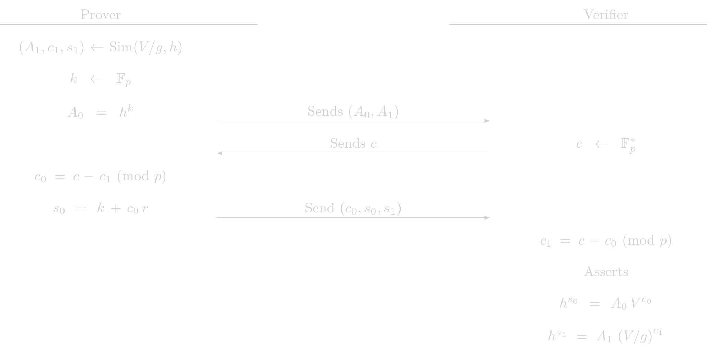

# Bit Proofs
This protocol is usded to prove that a committed value is either zeor or one without revealing which one is correct. It is a fundamental piece of the Range protocol. Given a commitment of the form
$$
V = g^b h^r
$$
where \\(g\\) and \\(h\\) are two generator points with discrete log relation unknown, \\(b\\) is either \\(0\\) or \\(1\\) and \\(r\\) is a blinding factor. We have two path here
1. \\(b\\) is  \\(0\\), then \\(V = h^r\\) 
2. \\(b\\) is  \\(1\\), then \\(\frac{V}{g} = h^r\\) 

Note that in each cases it is enough to use a POE to show knowledge of \\(r\\). Two show that one of the paths is the correct one without revealing which one is the case, we have to combine two POE protocols with an OR statement.

> **Note**: Given two Sigma protocols, the way of combine them in an OR statement is well known. The idea is that the prover will use the standard protocol for the statement that is true (i.e. that can be proven) and simulate a valid transcript for the statment that is false. On validation, the verifier will know that only one of the statement is simulated but it will be imposible to known which one it is.  

Bit proofs demonstrate that a committed value is either 0 or 1 using OR proof construction.

## Simulator for POE
A valid transcript for the [POE](poe.md) protocol is a triad \\((A, c, s)\\) that passes the validation check of the verifier. The POE protocol is used to show, given a  \\(y\\), knowledge of \\(x\\) shuch that \\(y = g^x\\). A simulator for this protocols is an algorithm that, given \\(y\\), produces a valid transcript, without knowledge of \\(x\\). In this case the simulator is
$$\begin{array}{ll}
    Sim\left(y,g\right) &\rightarrow  (A, c,s ): \lbrace \\\\
    & c \leftarrow \mathbb{F}_p^{\*}\\\\
    & s \leftarrow \mathbb{F}_p^{\*} \\\\
    & A = g^s/y^c \\\\
    & \text{returns} (A,c,s) \\\\
    \rbrace &
    \end{array}
$$
this transcript will pass the verifier because
$$
g^s = A y^c = \dfrac{g^s}{y^c} y^c = g^s
$$

> **Aclaration**: Even though the simulaton can produce a valid proof for the POE protocol, it can never be used to convince to a verifier by engaging the a real interaction. In Sigma protocols the challenge \\(c\\) is chosen by the verifier after all the messages \\(A\\) were committed by the prover. The flow of the simulator implies that the message \\(A\\) is to be selected after the prover sees the challenge.

## Protocol (Interactive)
Let say we are in the fisrt case, that is, we have \\(b=0\\), the commitment \\(V\\) is
$$
    V = h^r
$$

If we are in the second case, that is, we have \\(b=1\\), the commitment \\(V\\) is
$$
    V = g\ h^r
$$

Note that in both cases the verifier performs the same steps. The prove must perform different steps according what POE is going to be simulated. In both cases the prover sends $c_0$, even in the case that $c_0$ is given by the simulator. This is part of the protocol and it is to avoid revealing which $c_i$ was simulated. 

## Cost Analysis (EC Operations)

### Prover Complexity
- 3 EC multiplications
- 1 EC addition

### Verifier Complexity
- 4 EC multiplications
- 3 EC addition

## Usage in Tongo

This protocol is not directly used in Tongo. It is used in an indirect way as part of Range protocol.
