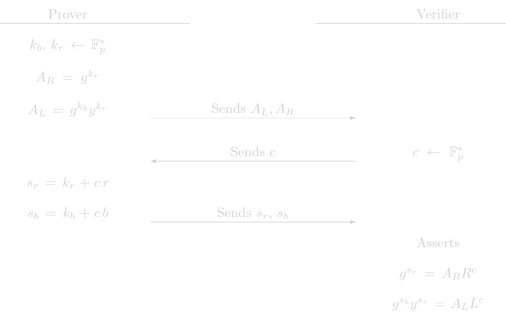

# ElGamal

Given a public key \\(y\\), an ElGamal encryption of an amount \\(b\\) with randomness \\(r\\) is a pair of elliptic curve points of the for

$$
(L, R) = \left( g^b y^r,\ g^r\right)
$$
where $g$ is the chosen generator. This protocol is used to prove to a verifier that a given ElGamal encryption is exactly of this form. To show this, the prover must prove knowledge of:
1. \\(r\\) such that \\(R = g^r\\)
2. \\(b\\) such that \\(L = g^b y^r\\) for the given public key and with the same \\(r\\) as before.

Note that the first assertion can be proven with a POE protocol and the second one with a POE2 protocol. We just need to combine the both of them in a single protocol.

> **Aclaration**: The two generators used in the POE2 procol must satisfy that there is not know discrete log relation between them. Here, the two generators would be \\(g\\) and \\(y\\) whose discrete log relation is the secret key \\(x\\) known by the owner of the public key. A simple POE2 protocol in this setup would be insecure. The extra restriction that the blinding factor \\(r\\) is encoded in the $R$ part of the encryption is enoguh to avoid any posible attack to the POE2 protocol.

## Protocol (Interactive)

The checks the verifier performs are actually a POE check and a POE2 check. This protocol delegates the assertions to the fundamental building blocks POE and POE2.

## Cost Analysis (EC Operations)

### Prover Complexity
- 3 EC multiplications
- 1 EC addition

### Verifier Complexity
- 5 EC multiplications
- 3 EC addition

## Usage in Tongo
All encryptions given by the user in Tongo pass through ElGamal protocol. Most of them are invoked by another SHE protocol that shows that two given encryptions are valid and they are indeed encrypting the same amount. 
