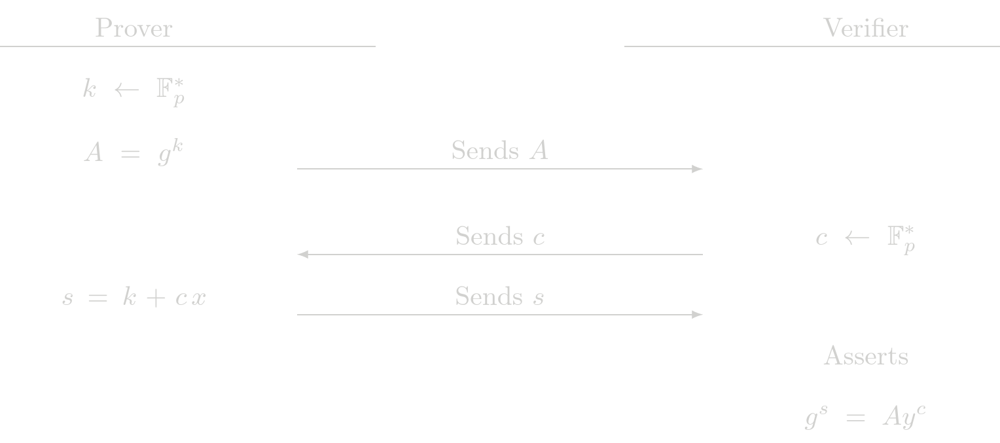

# Proof of Exponent (POE)

The POE protocol is a building block of other protocols. Given the relation 

$$ y = g^x $$

where \\(g\\) is a known generator point, \\(y\\) is a known public point and \\(x\\) is the secret witness. A Zero-Knowledge proof of exponent is used to show knowledge of \\(x\\) such that the previous relation holds.

## Protocol (Interactive)

## Cost Analysis (EC Operations)

### Prover Complexity
- 1 EC multiplications

### Verifier Complexity
- 2 EC multiplications
- 1 EC addition

## Usage in Tongo

POE is directly used in Tongo to prove account ownership in all operations. It is also used indirectly as a building block of other SHE protocols.
