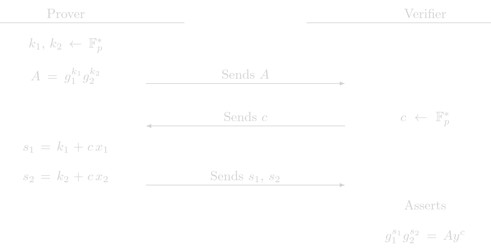

# Proof of 2 Exponent (POE2)

The POE2 protocol is the fisrt generalization of the POE protocol. Given the relation

$$ y = g_1^{x_1} g_2^{x_2} $$

where \\(g_1, g_2\\) are two generator points with discrete log relation unknown, \\(y\\) is a known public point and \\(x_1, x_2\\) are the secret witnesses. The POE2 procolo is used to show knowledge of \\(x_1, x_2\\) such that the previous relation holds. The POE2 protocol is used by SHE in the ElGamal protocol, which is a ZK protocol that shows the correctness of an ElGamal encryption.

## Protocol (Interactive)

## Cost Analysis (EC Operations)

### Prover Complexity
- 2 EC multiplications
- 1 EC addition

### Verifier Complexity
- 3 EC multiplications
- 2 EC addition

## Usage in Tongo

POE2 is not used directly by Tongo, it is used in an indirect way as a part of ElGamal protocol to verify encryption related Zero-Knowledge proofs.
