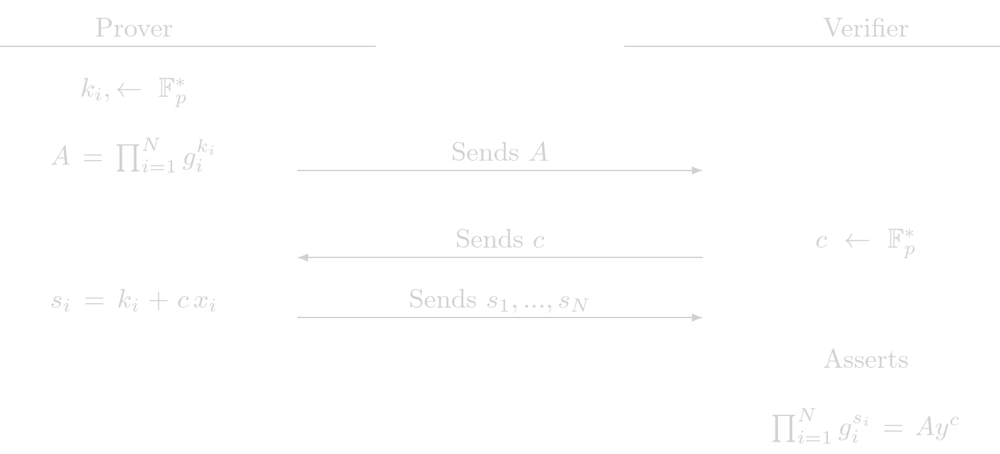

# Proof of N Exponent (POEN)

The POEN protocol is the generalization of POE to N exponents. Given the relation

$$ y = \prod_{i=1}^{N} g_i^{x_i}$$

where \\(g_i\\) are \\(N\\) different generatos  with discrete log relation unknown, \\(y\\) is a known public point and the set of  \\(x_i\\) are the secret witnesses. The POEN procolo is used to show knowledge of \\(x_i\\) such that the previous relation holds.

> **Design choice**: Althoug POE and POE2 are particular cases of this protocol and having only the protocol POEN should be enough, we have decided to have the three protocols to reduce some overhead.

## Protocol (Interactive)

## Cost Analysis (EC Operations)

### Prover Complexity
- N EC multiplications
- N-1 EC addition

### Verifier Complexity
- N+1 EC multiplications
- N EC addition

## Usage in Tongo

POEN is not directly used by Tongo and it is not used by another SHE protocol at the moment.
