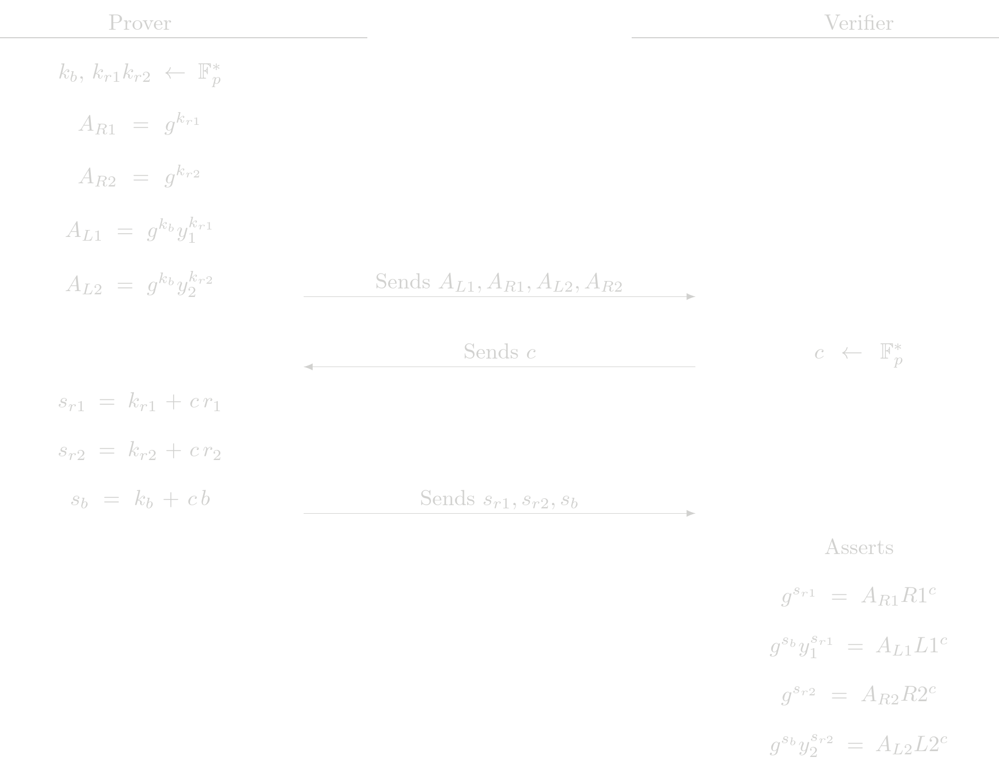

# Same Encryption Proof

Given two ElGamal encryptions of an amount \\(b\\) for two (possibly different) public keys \\(y_1\\) and \\(y_2\\), this protocol is used to convince a verifier that both encryptions are valid ElGamal encryptions under their respective public key and that both of them encrypt the same amount. In this proof, the prover is assumed to know the randomness of both encryptions and, of course, the amount \\(b\\).

The encryptios are
$$
(L1, R1) = \left( g^b y_1^{r_1},\ g^{r_1}\right)\\\\
(L2, R2) = \left( g^b y_2^{r_2},\ g^{r_2}\right)
$$
The prover must show that:
1. \\((L1, R1)\\) is a valid encryption under \\(y_2\\) for and amount \\(b\\)
2. \\((L2, R2)\\) is a valid encryption under \\(y_2\\) for the same amount \\(b\\) 

Note that the both assertion can be proven with ElGamal protocol. We just have to combine them in a way that the share the same secret value \\(b\\) 
 
## Protocol (Interactive)

The checks the verifier performs are actually two ElGamal protocol checks. This protocol just delegates these assertions.

## Cost Analysis (EC Operations)
### Prover Complexity
- 6 EC multiplications
- 2 EC addition

### Verifier Complexity
- 10 EC multiplications
- 6 EC addition

## Usage in Tongo
In a trnasfer operation in Tongo,  the sender must provide two encryption of the same amount, one is to be added to the pending balance of the receiver and the other one to be subracted from the sender's balance. The sender uses this protocol to show the validity of those encryptions.

# Variation: Unknown Random
This variation of the previous protocol allows the prover to ignore the randomness of one of the encryptions. The price to pay is that the prover must know the secret  \\(x\\) of the public key \\(y= g^x\\) the encryptions is made for. This works because the \\(L\\) point in a valid ElGamal encryption can be seen as a commitment to \\(b\\) and \\(x\\) with generators \\(g\\) and \\(R\\), that is

$$
(L, R) = \left( g^b y^{r},\ g^{r}\right) = \left( g^b R^{x},\ R\right) 
$$
In the RHS of the previous equation, the randomness is unknown. We can prove that this is a correct encryption with a POE2 protocol for the \\(L\\) part of the encryption

> **Aclaration**: The two generators used in the POE2 procol must satisfy that there is not know discrete log relation between them. Here, the two generators would be \\(g\\) and \\(R\\) whose discrete log relation is the randomness \\(r\\) that might be known by the constructor of the original encryption. A simple POE2 protocol in this setup would be insecure. The extra restriction that the secret \\(x\\) is exactly the secret of the public key \\(y\\) is enoguh to avoid any posible attack to the POE2 protocol.

We have in this setup two encryptions
$$
(L1, R1) = \left( g^b R1^{x},\ R1\right) \\\\
(L2, R2) = \left( g^b y_2^{r_2},\ g^{r_2}\right)
$$

The prover must show that:
1. Knowledge of \\(x\\) such that \\(y = g^x\\) 
2. Knowledge \\(b\\) such that \\(L1 = g^b R1^x\\) for the given \\(R1\\)  key and with the same \\(x\\) as before.
3. \\((L2, R2)\\) is a valid encryption under \\(y_2\\) for the same amount \\(b\\) 

> **Design choice** There is a way to reuse the original SameEncrypt protocol to prove this. The way of do it requires swapping  \\(r_1 \leftrightarrow x\\) and \\(R1 \leftrightarrow y_1\\). We think that making these changes to call provers/verifiers would be very confusing and error prone. So we have decided to write a separate protocol to handle this case.

## Protocol (Interactive)

### Verifier Complexity
- 10 EC multiplications
- 6 EC addition

## Usage in Tongo
In transfers/withdraw operations in Tongo, user must show that the remaining balance, after the operation, is positive. Zero-Knowledge proof in these cases are to be checked against the current balance of the account. Users generaly dont know the randomness of the encryption of the current balance:  is the sum of all randomness generated by the senders, of previous incoming transfers that had them as receiver. 

To prove that the remaining balance is positive, the Zero-Knowledge proof consists in the creation of an auxiliar encryption, for this encryption a Range protocol shows that is encrypting a positive balance, and then the prover shows that this auxiliar encryption and the current balance of the account are the same. For this last step, the `UnknownRandom` version of the `SameEncrypt` protocol is used
