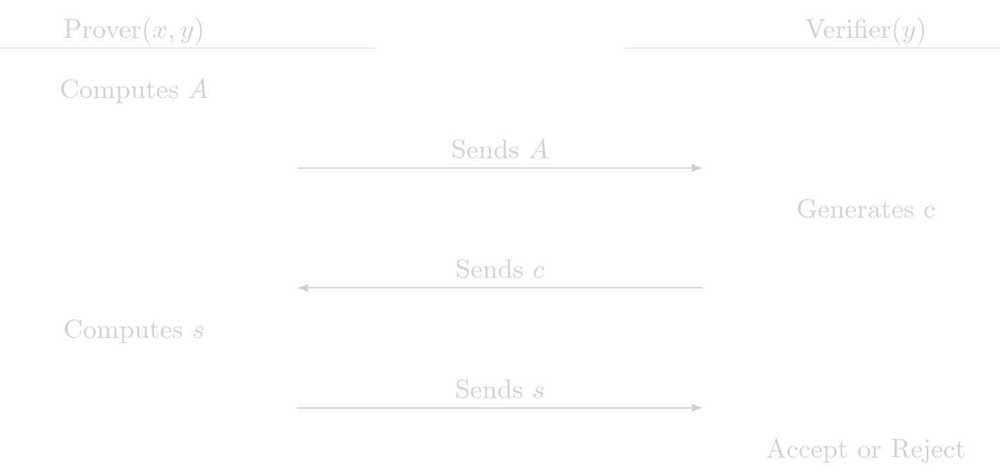

# Sigma Protocols
All protocols implemented in SHE are Sigma protocols. A Sigma protocol is a protocol in which a prover  \\(P\\) and a verifier \\(V\\) interact, after the interaction the verrifier can be convinced that the prover has knowledge of some witness \\(x\\) that satisfies a statement \\(y\\), the general strutcute of the interaction between the prover and the verifier is
1. \\(P\\) computes a message \\(A\\) called commitment and sends it to \\(V\\) 
2. Upon receiving \\(P\\)'s commitment \\(A\\), \\(V\\) chooses a challenge \\(c\\) at random  and sends it to  \\(P\\)
3. Upon receiving \\(V\\)'s challenge \\(c\\), \\(P\\) computes a response \\(s\\) and sends it to \\(V\\) 
4. Upon receiving \\(P\\)'s response \\(c\\), \\(V\\) outputs either `accept` or `reject` based only on the statement \\(y\\)  and the interaction \\((A, c, s)\\).



## Fiat-Shamir Euristics
The protocol descrived above is interactive because the prover and the verifier are forced to respond one to another. The standar way of converting an interactive protocol into a non-interactive one is by using the Fiat-Shamir heuristic. Broadly speaking this means to use as a challenge \\(c\\) some hash of the commitment \\(A\\). This means the prover can compute \\(c\\) and there is not need to wait for the verifier to create a full proof.

> **Warning** Appliying the Fiat-Shamir transformation is very critical. There is a fundamental reason in the original protocol for the verifier to wait upon reception of the commitment \\(A\\) to create a challenge \\(c\\). Usually a prover that has seen the challenge before commiting anything can forge a proof without knowledge of the witness \\(x\\). 

## Implementation in SHE
In the cairo implementation of the SHE protocols, for each protocol  we expose a `verify()` function. This function mimics the last step for the verifier. It accepts or rejects the proof and take as imputs the statement \\(y\\), the commitment \\(A\\), the challenge \\(c\\) and the response \\(s\\). 

We have also exposed functions called `verify_with_prefix()`. These functions dont take the challenge \\(c\\) as an input, in its place the take a `prefix`. Internally the function computes the challenge \\(c\\) by hashing the comitment \\(A\\) with the given prefix
$$
 c = \text{Hash}(\text{prefix}, A)
$$
The prefix is useful to bind some external data to the proof (the proof at this stage can also be seen as a signature of the prefix). For example in Tongo part of the `prefix` is the `chain_id` so any proof intended to be validated in mainet will not be valid in sepolia. 

Here there is a example of the implementation of this function for the [POE](poe.md) protocol

```rust
pub fn verify_with_prefix(inputs: PoeInputs, proof: PoeProofWithPrefix) -> Result<(), Errors> {
    let PoeInputs { y, g } = inputs;
    let PoeProofWithPrefix { A, prefix, s } = proof;
    let commitments = array![A];
    let c = compute_challenge(prefix, commitments);
    verify(y, g, A, c, s)
}
```

